---
 
After 2 years at **42 Belgium** and now studying **systems security at EPHEC**. I work mainly in **C and C++** — system programming, networking, concurrency — and I am expanding into **backend development** with TypeScript, Node.js and PostgreSQL. What drives me: software that controls real systems, and making it reliable and secure.
 
###  Currently
 
-  Bachelor in Systems Security — EPHEC (2026–2029)
-  Learning backend development with TypeScript, Express and PostgreSQL
###  Languages
 

 
###  Backend & Data
 

 
###  Infrastructure & Tools
 

 
###  Engineering focus
 
| | |
|---|---|
| **Systems** | memory management · multithreading & concurrency · state machines · sockets · client–server architecture |
| **Backend** | REST API design · relational data modeling · SQL constraints & transactions · parameterized queries · HTTP error handling |
| **Networking & infra** | TCP/IP · HTTP · TLS · subnetting · containerized services · Linux system administration |
 
---
 

 

 
